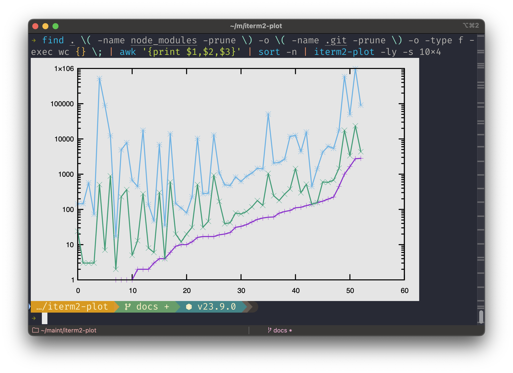

# iterm2-plot

Plot datapoints to stdout inside your [iTerm2](https://iterm2.com/) window on
MacOS.

## Installation

```sh
npm install -g iterm2-plot
```

## Example

This shell fragment will find all of the files in the current directory tree,
find their line, word, and character counts, remove their file names, sort
them by number of lines, then plot them into the current terminal window with
a logarithmic y scale so that the widely-disparate line and character counts
will show up interestingly on the same graph.

```sh
find . \( -name node_modules -prune \) \
  -o \( -name .git -prune \) \
  -o -type f -exec wc {}  \; | \
awk '{print $1,$2,$3}' | \
sort -n | \
iterm2-plot -ly
```



## Command Line Options

```txt
Usage: iterm2-plot [options] [files...]

Arguments:
  files                         File to read from, or "-" for stdin (default:
                                ["-"])

Options:
  -b, --background <colorName>  Background color name or #6hexdig (default:
                                "gray90")
  -d, --dimensions <WxH>        Width x Height in pixels.  0 reads from the
                                terminal. (default: "0x0")
  -l, --log <axes>              Set X, Y, and/or count to log scale (choices:
                                "x", "y", "xy")
  -o, --output <filename>       Output svg to file instead of chart on stdout
  -x                            Treat first column as X for all following Y
                                columns (default: use row count)
  -h, --help                    display help for command
```

## API

Full [API documentation](http://hildjj.github.io/iterm2-plot/) is available.
No use cases are anticipated for this API, but it will remain stable according
to semver rules.

---
[](https://github.com/hildjj/iterm2-plot/actions?query=workflow%3ATests)
[](https://codecov.io/gh/hildjj/iterm2-plot)
